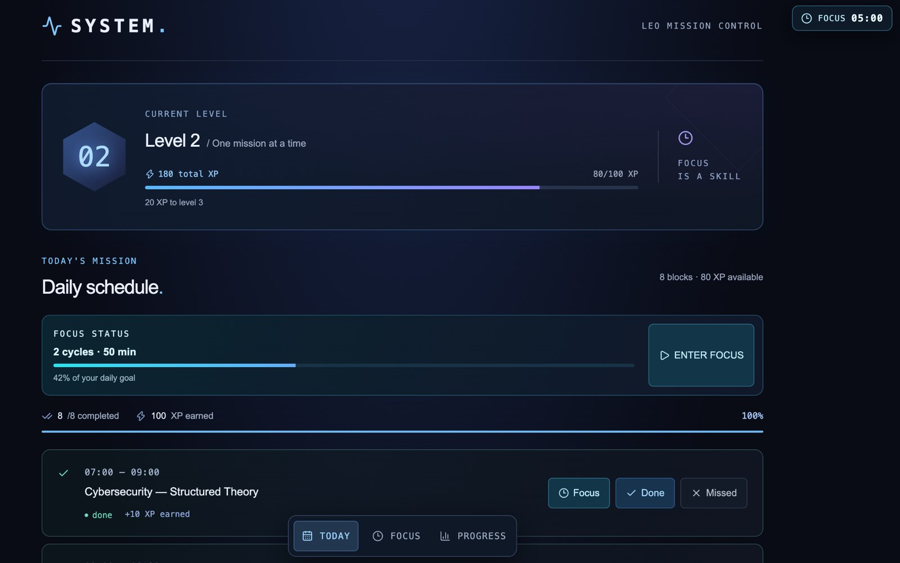
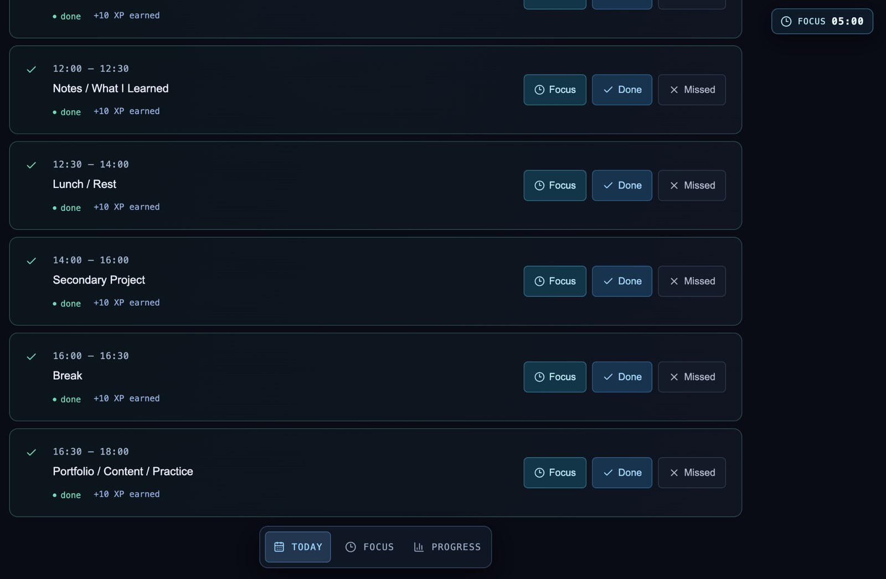
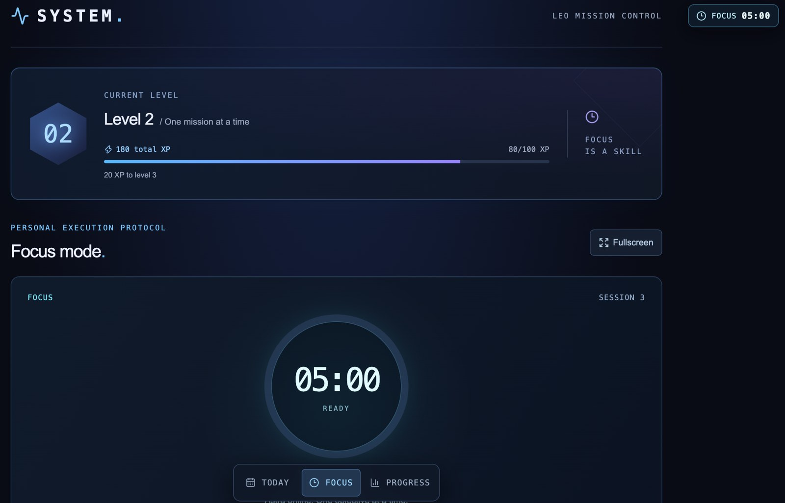
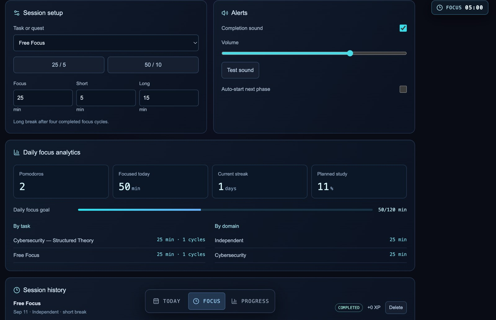
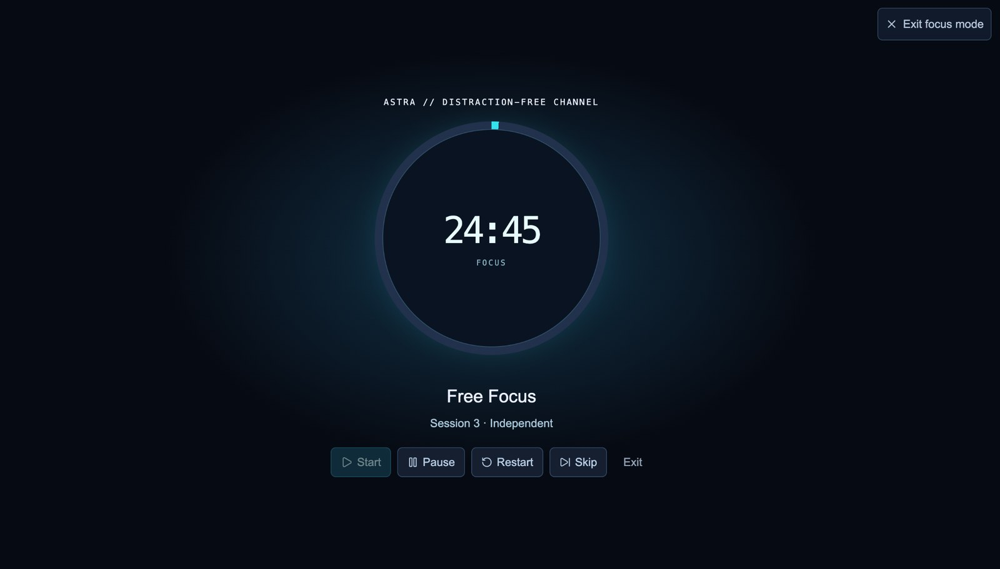

# SYSTEM — Screenshot Gallery

These captures document the current live prototype using real application states.

## 01 — Today Overview

**File:** `01-today-overview.jpg`

Shows the overall mission-control view with:

- Current level and total XP
- XP progress toward the next level
- Daily focus status
- Daily completion percentage
- Routine controls

## 02 — Daily Routine Blocks

**File:** `02-daily-routine-blocks.jpg`

Shows the lower portion of the daily schedule and the repeated execution pattern for each block:

- Time range
- Block title
- Done state
- XP earned
- Focus / Done / Missed controls

## 03 — Focus Mode

**File:** `03-focus-mode.jpg`

Shows the primary Focus workspace with:

- Session context
- Circular countdown timer
- Current level context
- Focus-mode navigation
- Fullscreen entry point

## 04 — Focus Analytics

**File:** `04-focus-analytics.jpg`

Shows the review layer connected to focused work:

- Session setup
- Alert controls
- Pomodoros completed
- Focused minutes
- Current streak
- Planned-study percentage
- Daily focus goal
- Breakdown by task and domain
- Session history

## 05 — Fullscreen Focus

**File:** `05-focus-fullscreen.jpg`

Shows the distraction-reduced execution mode with:

- Large countdown ring
- Current task
- Session context
- Essential timer controls
- Exit focus mode action

## Capture principles

These screenshots intentionally use real prototype data rather than staged mockups. They are meant to show the product as it currently exists, including its active-development state.
